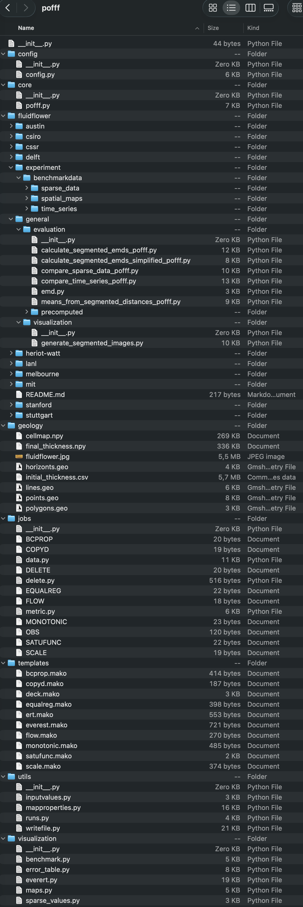

pofff Python API
================

The top-level executable coordinates configuration, grid and property generation, file writing, simulation, history matching, data processing, and visualization. ``fluidflower`` contains benchmark data, ``geology`` contains corner-point geometry, ``jobs`` contains ERT and Everest jobs, ``templates`` contains Mako inputs, ``utils`` connects the workflows, and ``visualization`` contains benchmark postprocessing.

   Files in the pofff package.

API files are regenerated under ``docs/text/api`` before each build.

.. toctree::
   :maxdepth: 2

   api/modules
