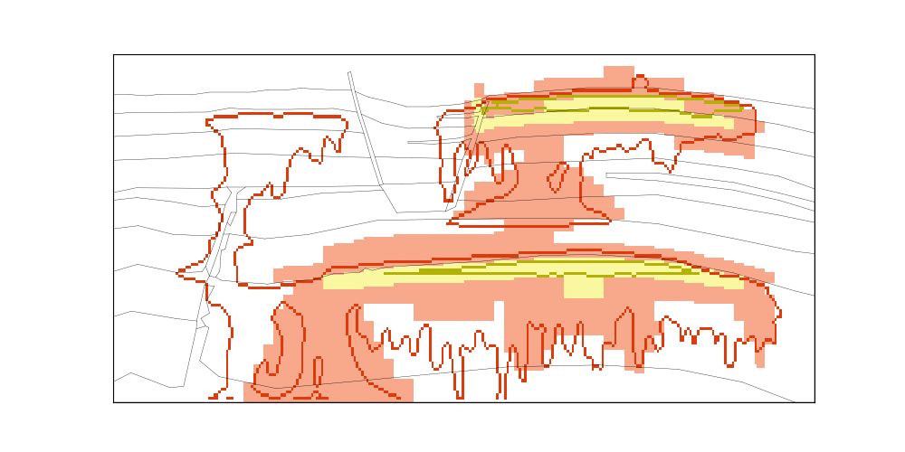
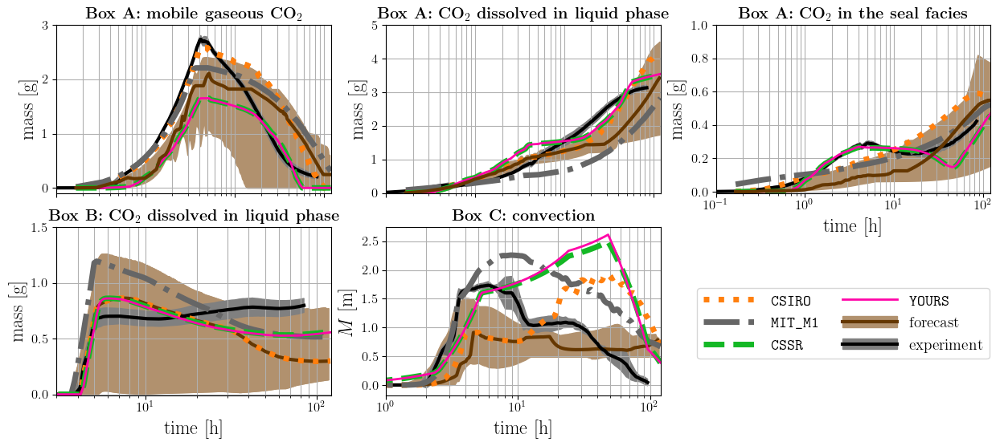
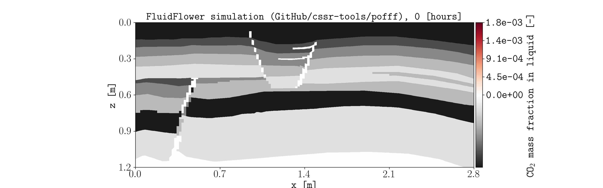

********
Examples
********

===========
Hello world 
===========

The `examples <https://github.com/OPM/pyopmspe11/blob/main/examples>`_ folder contains a few configuration files
with low grid resolution and shorter simulation times (for initial testing of the framework). For example, by executing:

.. code-block:: bash

    pofff -i single.toml -t 24,48,72 

The following is the figure `map_24h.png`. You can compare your example results to this figure to evaluate if your example ran correctly:

===================
Adding your results 
===================

The `publication <https://github.com/cssr-tools/pofff/blob/main/publication>`_ folder contains the configuration files used for the results in the
`pofff paper <https://link.springer.com/article/10.1007/s11242-025-02275-0>`_ (see :doc:`publication <./publication>` for details in the steps to reproduce the figures in the paper).

.. code-block:: bash

    pofff -i results.toml -o YOURS -m single -t 24,48,72,96,120 -f all

generates the figures in the paper in addition to the new simulation labeled as the name of the outpur folder ("YOURS" in this case), e.g., for the compare_all_time_series.png:

.. tip::
    
    One can always modify the plotting scripts to change the colors, line styles, font sizes, etc. 

We welcome pull request with your configuration files to the examples folder for cases with better results (less error in the error_table_satmin-0.01_conmin-0.1.csv).

.. note::
    
    One can always also generate the sparse_data.csv, time_series.csv, and spatial_map_Xh.csv files using other simulators and use the pofff tool to compare
    to the experimental data, forecast, CSIRO, MIT\_M1, and CSSR data. To this end, you can add those files to a folder call "MY\_SIMULATOR" and execute:

    .. code-block:: bash

        pofff -t 24,48,72,96,120 -m none -o MY_SIMULATOR -f all

    Note that the spatial maps csvs need to be given in the x range of 0 to 2.8 m and z range of 0 to 1.2 m. 

================
History matching 
================

The flag **-m** can be set to **everest** or **ert** to run the history matchings, which also requires to set additional 
variables in the toml configuration file (e.g., parameters to history match, number of parallel runs, random seed). For example, to run the 
last iteration of the history matching in the pofff paper corresponding to `everest_iter_3.toml <https://github.com/cssr-tools/pofff/blob/main/publication/everest_iter_3.toml>`_:

.. code-block:: bash

    pofff -i everest_iter_3.toml -o everest_iter_3 -m everest -t 24,48,72,96,120 -f all

.. warning::
    
    If you are running everest_iter_3.toml locally in your machine, then you might need to decrease the number of parallel runs (cores = 50 in line 39) and maximum function evaluations (max_function_evaluations = 200000) to your system capabilities.

The possible parameters to hm are the 13 parameters for facie 1 to 6 (e.g., permx2, pen5, np6), in addition to consider isotropic permeability (e.g., perm3), and a constant to multiply the tickness (i.e., thicknessmult).
For additional examples on how to set the history matching studies using ert or everest, 
see/run the scripts in the `tests <https://github.com/OPM/pyopmspe11/blob/main/tests>`_ and `publication folder <https://github.com/OPM/pyopmspe11/blob/main/publication>`_.

.. note::
    
    We refer to the documentation of `everest <https://everest.readthedocs.io/en/latest/configuration/reference.html>`_ and `ert <https://ert.readthedocs.io/en/latest/reference/configuration/keywords.html#>`_
    for the description of the different keywords. While via the toml configuration files in pofff we have added the most common keywords, then one could always 
    add additional keywords to the generated (after execution of pofff) everest (everest.yml) and ert (ert.ert) configuration files, and after running the history matching directly using the everest/ert command line executables.
    Details on all supported (and format types) variables that can be assigned via toml configuration files can be found in `config.py <https://github.com/cssr-tools/pofff/blob/main/src/pofff/config/config.py>`_.
    After the runs, one can always use pofff to postprocess the data and generate the figures, running with the flag **-m none** (see the 
    `profiling.py <https://github.com/cssr-tools/pofff/blob/main/publication/sprofiling.py>`_ for an example of splitting the generation of the files, running of everest, and postprocessing).
    Please raise an issue for missing keywords in the toml configuration files that you would like to be added.

=============
Visualization
=============
To postprocess the data, `plopm <https://github.com/cssr-tools/plopm>`_ can be used. 

.. tip::
    You can install `plopm <https://github.com/cssr-tools/plopm>`_ by executing in the terminal:
    
    .. code-block:: bash
        
        pip install git+https://github.com/cssr-tools/plopm.git

For example, if you run the `appendixb.toml <https://github.com/cssr-tools/pofff/blob/main/publication/appendixb.toml>`_ configuration file and change the 'inj' variable in line 17 to:

.. code-block:: bash

    inj=[[8100, 300, 3E-7, 0], 
    [10200, 300, 3E-7, 3E-7],
    [3300, 300, 0, 0], 
    [64800, 3600, 0, 0], 
    [345600, 21600, 0, 0]]

Then the following GIF is generated by:

    .. code-block:: bash

        pofff -i appendixb.toml -o pofff+plopm -m single -c '5e-2' -f none
        plopm -v xco2l -i 'pofff+plopm/POFFF+PLOPM' -d 16,5 -mask satnum -m gif -dpi 1000 -f 20 -loop 1 -cformat .1e -cbsfax 0.30,0.01,0.4,0.02 -interval 437.5 -maskthr 1e-5 -tunits h -cnum 5 -clabel 'CO$_2$ mass fraction in liquid [-]' -t 'FluidFlower simulation (GitHub/cssr-tools/pofff),'

    The total simulation time for this GIF (five days of experiment) using eight CPUs for OPM Flow in a Mac is **LESS THAN TWO MINUTES!!!**

   

See the `plopm online docmunetation <https://cssr-tools.github.io/plopm/>`_ for additional information of supported flag parameters to generate customized PNGs and GIFs.
