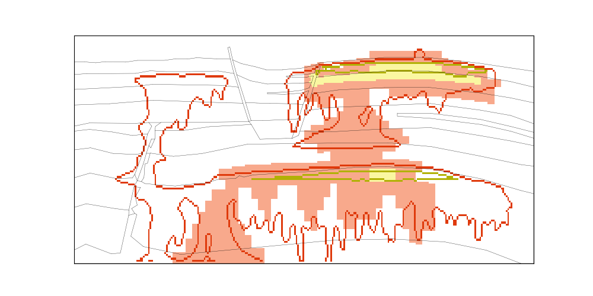

********
Examples
********

===========
Hello world 
===========

The `examples <https://github.com/OPM/pyopmspe11/blob/main/examples>`_ folder contains a few configuration files
with low grid resolution and shorter injection times (for initial testing of the framework). For example, by executing:

.. code-block:: bash

    pofff -i single.toml -t 24,48,72 

The following is the figure `map_24h.png`. You can compare your example results to this figure to evaluate if your example ran correctly:

