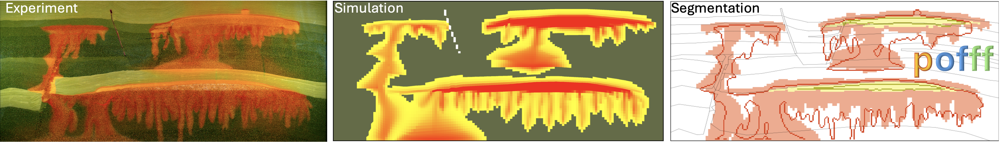

============
Introduction
============

.. video:: figs/pofff_fluidflower.mp4
   :width: 700

This documentation describes the **pofff** tool hosted in `https://github.com/cssr-tools/pofff <https://github.com/cssr-tools/pofff>`_.

Concept
-------
User-friendly open-source image-based history-matching framework for the FluidFlower benchmark study using OPM Flow.

.. _overview:

Overview
--------
The current implementation supports the following executable with the argument options:

.. code-block:: bash

    pofff -i name_of_input_file.toml

where 

-i  The base name of the :doc:`toml configuration file <./configuration_file>`, ('input.toml' by default).
-o  The base name of the :doc:`output folder <./output_folder>` ('output' by default).
-f  Use 'all' to generate all benchmark figures, 'basic' to not generate the Wasserstain distance plot (it is slow), and 'none' for no figures ('basic' by default).
-m  Run a 'single' simulation, generate only the input 'files', generate only the csv 'data', 'everest', 'ert', 'fair', or 'none' ('none' is useful to generate only figures in combination to '-f') ('single' by default).
-t  Times in hours separated by commas to evaluate the metrics ('0.25' by default).
-e  Experimental data to history match, valid options are C1 to C5 ('C2' by default).
-s  The minimum saturation above which gaseous CO2 is considered for the segmentation ('1e-2' by default).
-c  The minimum concentration above which CO2 is considered to be dissolved for the segmentation ('1e-1' by default).
-u  Use the precomputed Wasserstein distance matrix values for minimum concentration of 1e-1 and 5e-2 (minimum saturation of 1e-2) to speed up the computations ('1' by default; set to '0' to compute all).
