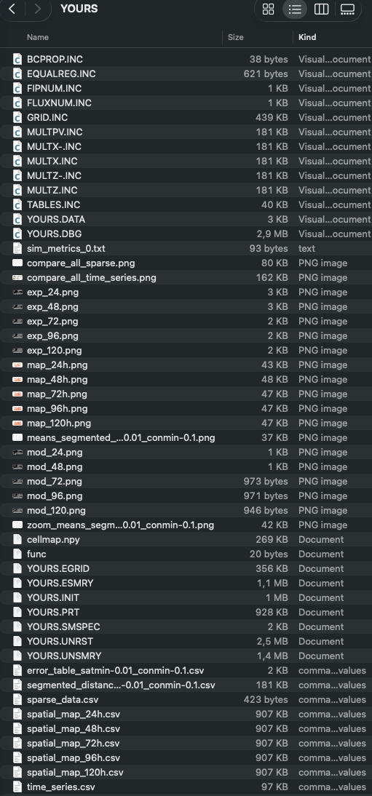
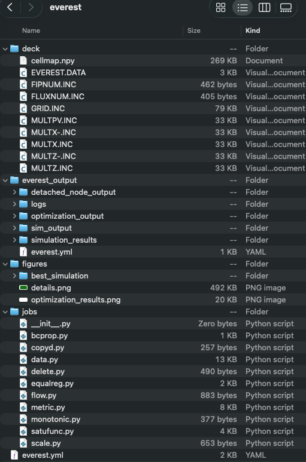
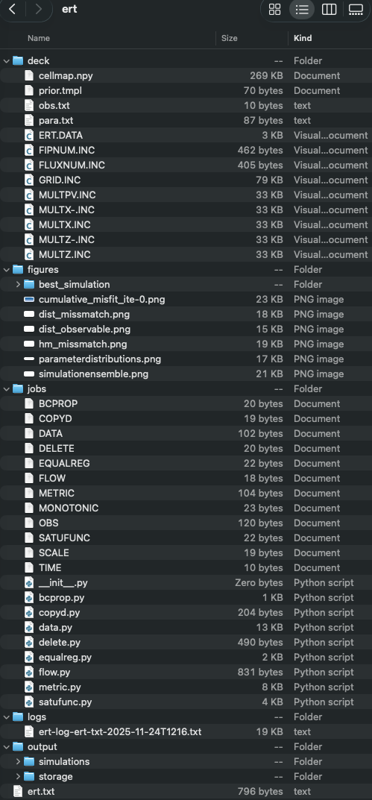

Output folder
=============

==========
Single run
==========

The following screenshot shows the generated files in the output folder after executing **pofff**
in the **Adding your results** subsection in the :doc:`examples <./examples>`.

=======
Everest
=======

The following screenshot shows the generated files in the output folder after executing **pofff**
in the `everest.toml <https://github.com/cssr-tools/pofff/blob/main/examples/everest.toml>`_:

.. code-block:: bash

    pofff -i everest.toml -o everest -m everest

The best_simulation folder contains the closest simulation to the observations, and generates the tables
and pngs figures as in the single run folder.

===
ERT
===

The following screenshot shows the generated files in the output folder after executing **pofff**
in the `ert.toml <https://github.com/cssr-tools/pofff/blob/main/examples/ert.toml>`_:

.. code-block:: bash

    pofff -i ert.toml -o ert -m ert

The best_simulation folder contains the closest simulation to the observations, and generates the tables
and pngs figures as in the single run folder.

The generated OPM input, ERT and Everest configurations, job scripts, CSV data, and best-simulation files can be inspected and, where appropriate, edited and rerun. Use the commands in :doc:`examples` to reproduce additional output layouts.
